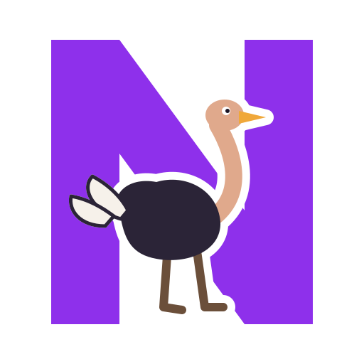
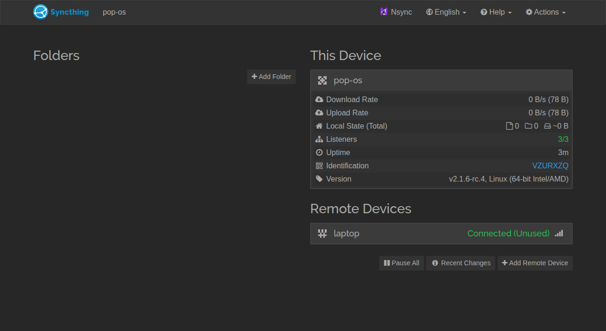
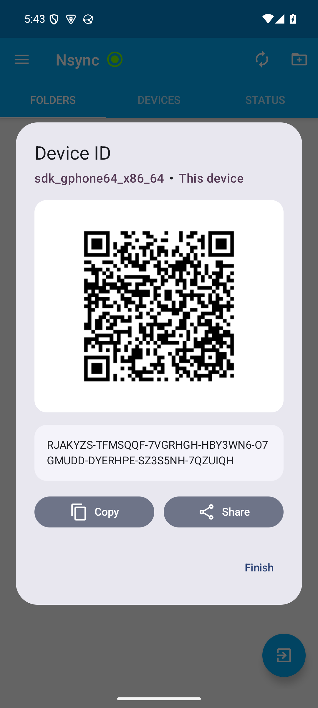
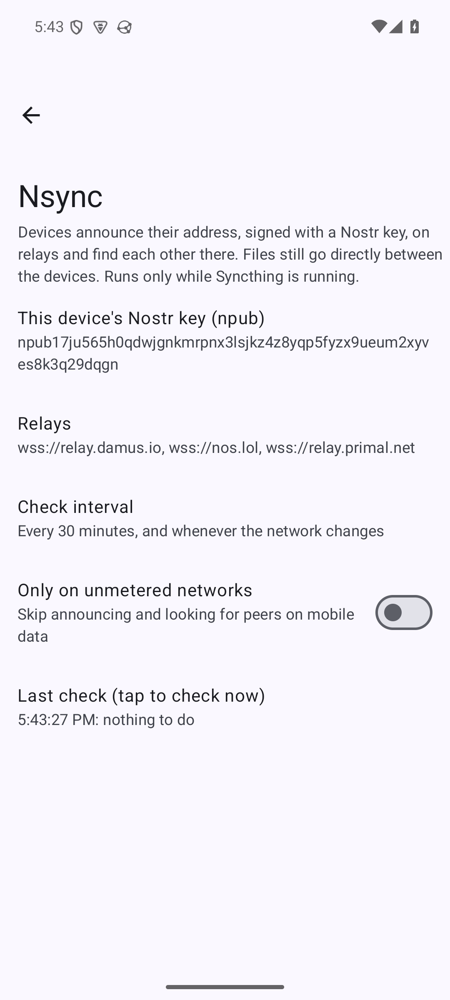

# Nsync

**Syncthing that finds your devices through Nostr relays.** Each device has its own Nostr key; devices
announce their address, signed, on public relays and look their paired peers up there. Files still go
directly between the devices through Syncthing. There is no discovery server to depend on, and Syncthing's
own discovery stays available as a fallback.

Nsync is a standalone app, not a companion: it carries the Syncthing core and runs it in a home of its own,
so it does not touch a Syncthing you already use.

 

## Install

**Linux** (Ubuntu 20.04+, Debian 11+, Pop!_OS, Mint): download `nsync_<version>_amd64.deb` from `releases/`, then

    sudo apt install ./nsync_<version>_amd64.deb

Open **Nsync** from the application menu: it starts and opens http://127.0.0.1:8385, which is Syncthing's
interface with an **Nsync** entry in the top bar. To keep it running from login:
`systemctl --user enable --now nsync`. Remove it with `sudo apt remove nsync` (your data in
`~/.config/nsync` is kept; delete it to start over).

**Android** (7.0+): install `Nsync-<version>.apk` from `releases/` (or from Zapstore). It is a fork of
Syncthing-Fork, installed as `app.nsync`, next to the original; do not run both at once.

Verify a download with `sha256sum -c SHA256SUMS`.

## Pair two devices

1. On each device open the Nsync panel (Linux: the **Nsync** entry in the top bar; Android: the
   **This device** tab / the device's QR). It shows a QR code and a pairing string, `npub…:DEVICE-ID`.
2. On the other device, scan the QR (Android: **+** → Scan QR code) or paste the string (Linux panel).
3. Do the same the other way round. A few moments later the two find each other through the relays.

Nsync only handles discovery; share folders in Syncthing as usual.

## How it works, and what it exposes

See [`nsync-linux/PROTOCOL.md`](nsync-linux/PROTOCOL.md). In short, a device publishes a signed, expiring
NIP-78 event with its addresses and a NIP-65 relay list; its paired peers read them. Announcements are
**plaintext**: relays, and anyone reading them, see the device's LAN and public IP and when it is online,
under a key that exists only for that device. That is no more than Syncthing's global discovery already
shows for any device ID. `announce_public: false` (Linux) announces the LAN address only.

## Layout

| Folder | What it is |
|---|---|
| `nsync-linux/` | The Linux app (Python): supervisor for the bundled core, web page, protocol spec, `.deb` packaging. |
| `nsync-android/` | The Android app: a fork of Syncthing-Fork with Nsync built in. See its `NSYNC.md`. |
| `releases/` | Installers. |
| `assets/` | Logo and screenshots. |
| `archive/` | An earlier Android companion app, kept for reference. |

## Build

Linux: `cd nsync-linux && ./packaging/build-syncthing.sh && ./packaging/build-deb.sh` (Go and Docker needed).
Android: see `nsync-android/NSYNC.md`.

## License

MPL-2.0, like Syncthing, which Nsync bundles unmodified. See `LICENSE`.
